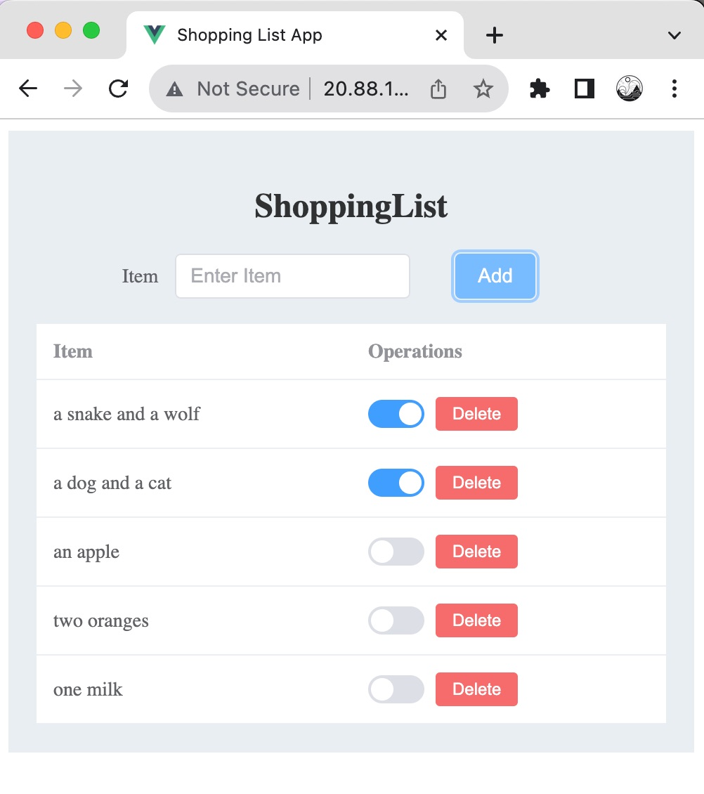
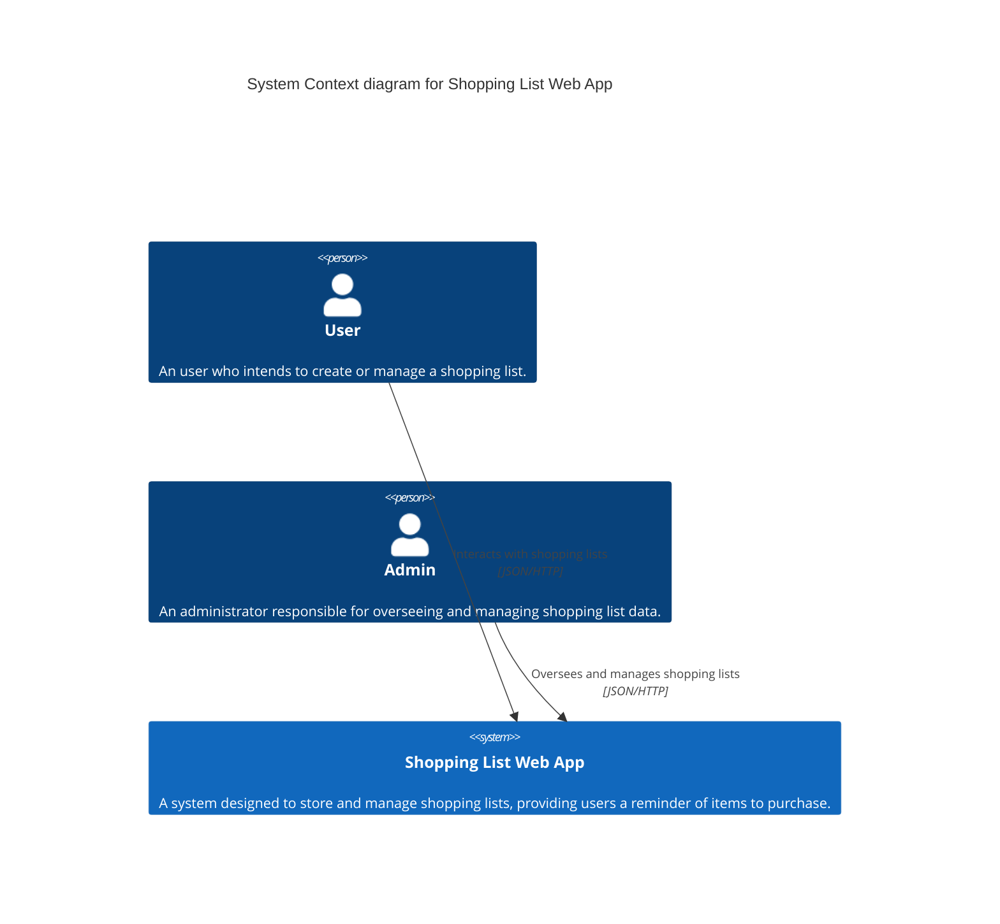
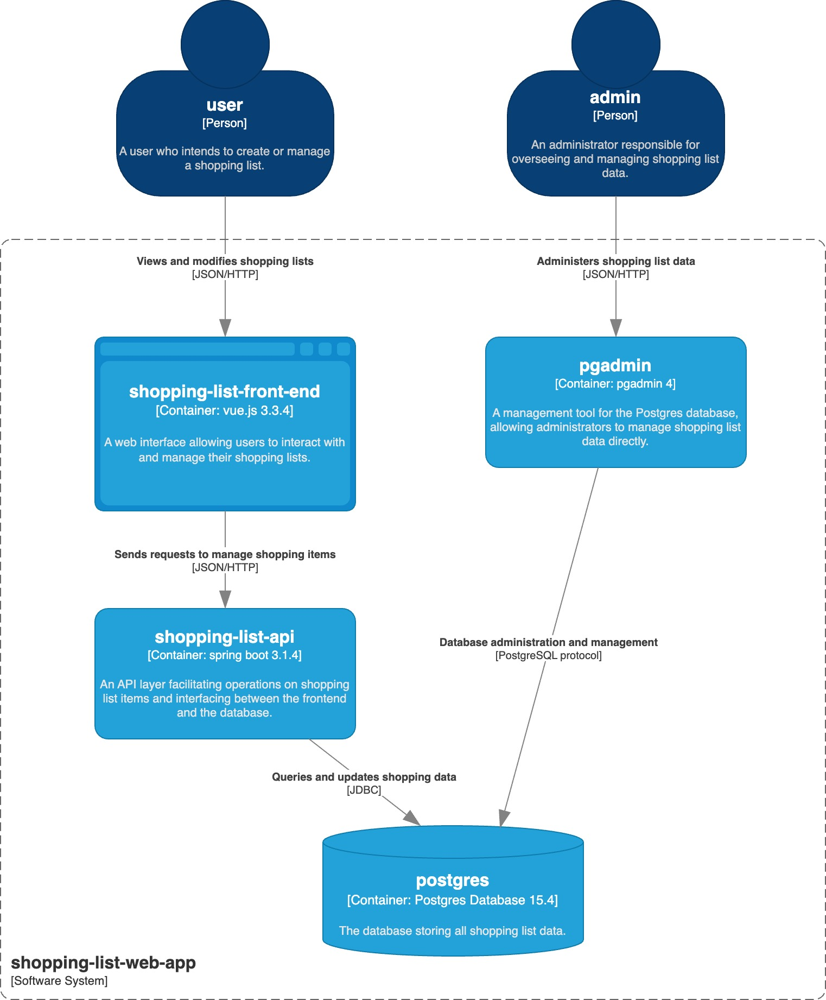
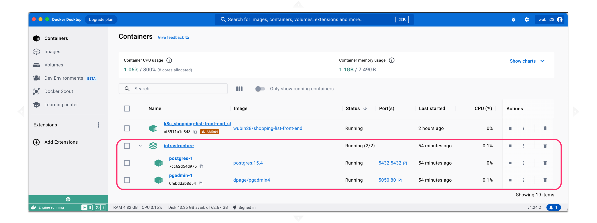
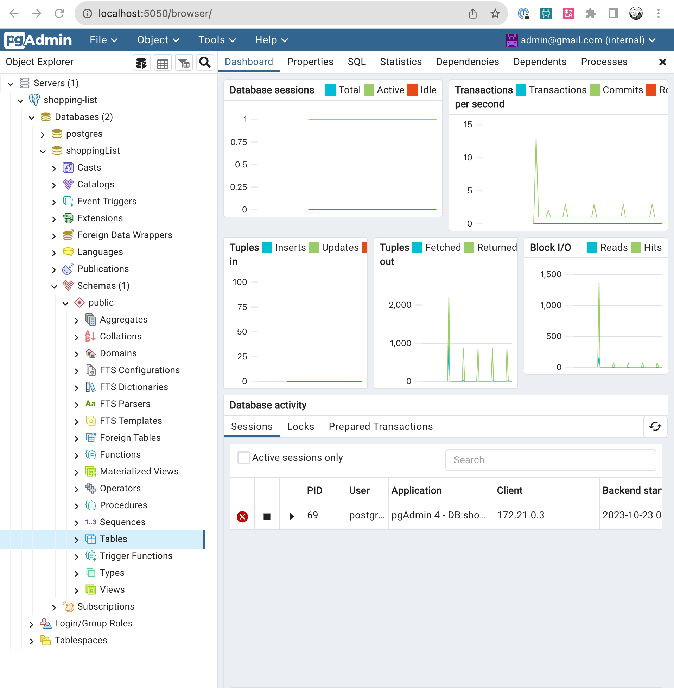
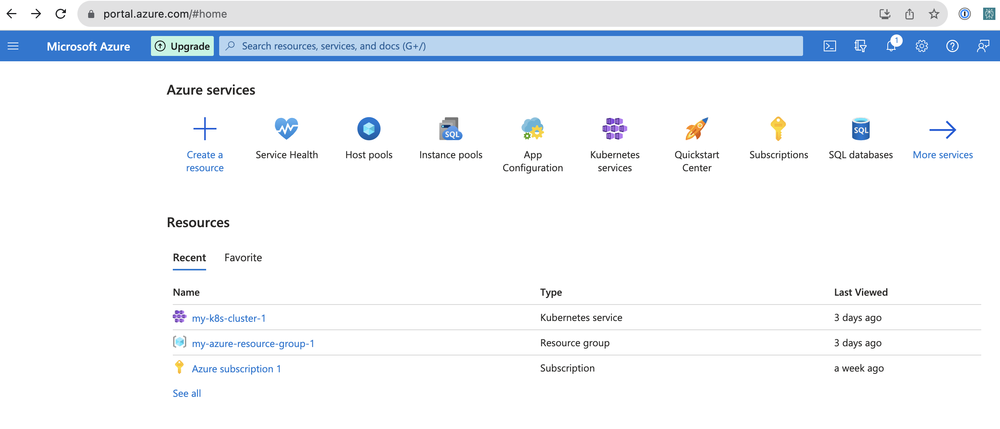
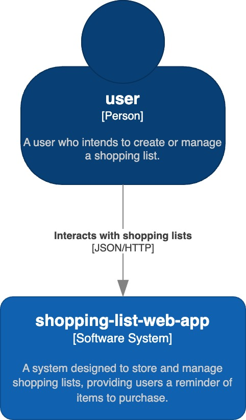
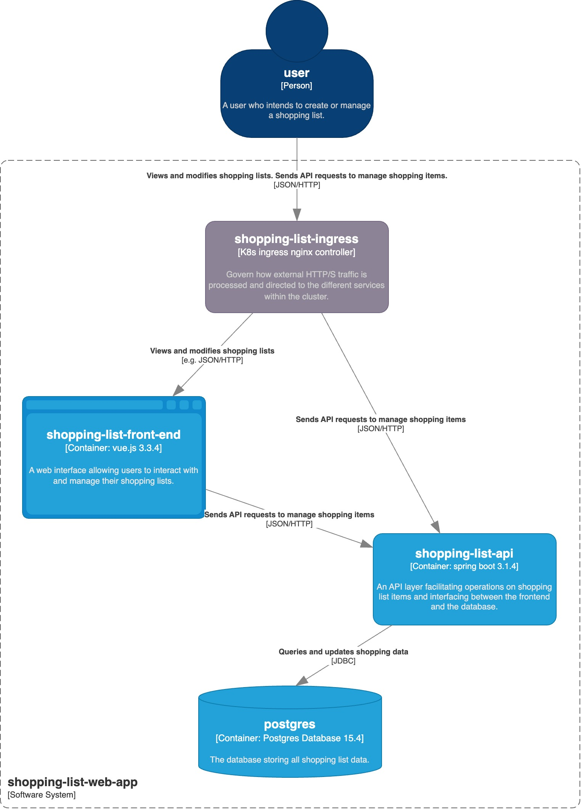

# Shopping List Web App

本代码库包含我的知乎“体验更好地做软件”专栏中以下文章的相关代码。


# 【万字长文】K8s部署前后端分离的web应用避坑系列指南之一：在本地开发环境、本地docker compose和k8s云集群里跑通购物清单应用（macOS-2023-10-27--12-40版）

> 做软件的人：“工作体验好，好事才能来。”

## 1 太长不读

从2023年8月到10月，我花了3个月自学docker和k8s。踩了一路坑，到10月22日终于把一个带有vue.js 3前端、spring boot后端以及postgres数据库的shopping list web app，部署到azure k8s service云上，并能正常运行。

之所以说踩了一路坑，是因为网上分享的k8s部署web app的样例，都是部署一个web服务。讲ingress nginx controller的样例虽然会涉及两个微服务，但在这种根据path设定将请求分配给两个hello world的web微服务场景中，两个微服务之间，是没有前后端之间的依赖关系的。另外前后端之间的CORS跨源资源共享该如何解决，也找不到我这种前后端分离的web app场景下的直接资料，只能自己摸索。

在爬出坑后，很愿意写一系列避坑指南文章分享给大家。虽然不知小伙伴们是否愿意读，但我很想把这一系列文章，写成网上通过实例讲docker和k8s入门的最好的文章，而且每年至少更新一次。

这一系列文章的目标读者，是对docker或k8s不太熟悉的做软件的人，不仅包括常写代码的程序员，也包括不常写代码的测试工程师和运维工程师，如图1所示。


图1 做软件的人包括程序员、测试工程师和运维工程师

K8s和Docker能解决做软件的人的什么痛点？这也是我为啥要花这么多时间写这一系列文章的原因。因为k8s和Docker可以让咱们做软件的人，能*体验更好地做软件*。

“工作体验好，好事才能来。”

想想咱们做软件的人常说的下面几句话。

**“在我这运行得好好的，怎么你那儿不行？”** docker image能将代码的所有依赖库都打包到一起，并能让代码在容器中独立运行。这样就能实现你在测试环境中所测试的image，就是你在生产环境所部署的，从而能在很大程度上解决因为依赖库在不同环境下的差异，而导致这里能运行，那里不能运行的问题。

**“这是谁改了配置又不告诉大家？”** Docker和k8s都强调基础设施即代码，即配置不是靠做软件的人拍脑袋临时手工敲的，而是靠写成与代码同等地位的配置文件，通过团队代码评审，保存到版本库中，并让机器执行。这样能让配置的更改广而告之，配置的执行有据可查。同时也便于让机器读取，自动执行，而无须手工一遍一遍敲同样的命令。

**“测试环境太少得排队使用。”** 有了本地docker compose，做软件的人可以利用其占用存储空间小，运行速度快的特点，在本地电脑以docker image的方式，最大限度模拟生产环境的方式，测试要发布的软件，而无须排队等公司共享的测试环境。这样能更早地发现bug，减少因很晚才发现所导致的大量返工成本。同样，在内部使用了k8s云集群的企业，也能利用云的多租户特点，快速为需要测试环境的做软件的人，分配测试环境，从而解决测试环境少的问题。

可见，Docker和k8s能让咱们做软件的人，工作体验更好，好事才更能来。

“为何选用Shopping List Web app作为样例项目？”这个样例源自我在自学vue.js时所学的待办清单todo list app样例，如图2所示。我把todo list改造为shopping list。两者的功能近似，都是为用户提供一个备忘清单，有一个web界面可以增删改查。这容易理解。此外，这个样例能代表前后端分离的web app典型架构。另外，这个样例能表现最小化的云原生微服务之间的依赖关系，比如前端微服务依赖后端微服务，而后端微服务又依赖于数据库微服务。这便于学习如何使用新兴的故障注入实验工具，进行混沌工程实践。



图2 购物清单shopping list web app页面

“我对java和vue.js不熟，能读懂这一系列文章吗？”能。因为文章的代码命名写得足够表意，一看就懂。另外，这一系列文章不涉及前后端具体的编程，而重点关注如何把开发好的代码用docker打成image，并部署到本地docker compose和k8s云集群上。这些都与前后端所使用的编程语言关系不大，所以文章内容适用于所有使用JSON/HTTP协议的前后端分离的web app的技术栈。

“我不会编程，能读懂这一系列文章吗？”能。因为文章不涉及前后端功能的代码编写，而主要涉及配置文件和命令行工具的使用，适合程序员、测试工程师和运维工程师阅读。

“我是做测试或运维的，还需要按照文章的描述，在本地开发环境里跑通吗？”需要。因为在本文所描述的避坑的过程中，你会发现之前代码中的配置有问题。当你需要在源代码里更改配置，并重新构建docker image时，你就需要知道如何操作。

这一系列文章的第一篇，会针对macOS、Windows10和Ubuntu这3种操作系统，分别推出3个版本。

这一系列文章可以分为三篇。这三篇的标题如下：

K8s部署前后端分离的web应用避坑系列指南之一：在本地开发环境、本地docker compose和k8s云集群里跑通购物清单应用（macOS/Windows10/Ubuntu-2023版分别写）

K8s部署前后端分离的web应用避坑系列指南之二：解读购物清单应用Dockerfile和docker-compose.yml文件

K8s部署前后端分离的web应用避坑系列指南之三：解读购物清单应用k8s的deployment、service和ingress配置文件

这一系列指南相关的源代码在这里下载：https://github.com/wubin28/shopping-list-web-app。

要想找到这一系列文章的最新版本，可以在知乎搜“体验更好地做软件”专栏。

## 2 深入阅读

注意，本文一万三千字。分享了8个避坑指南。需要拿着mac边读边练。没点决心坚持不下来。慎入。

### 2.1 需求描述

这一系列文章所选用的web app，是一个购物清单shopping list web app。它的用户是有购物需求的顾客小吾。一天，小吾发现家里的瓶装水快没了，就想着晚上下班路过超市时，顺便买几瓶。但这时老板来微信喊他开会。他很快就把买瓶装水的事情忘掉干干净净。等下班路过超市，他光顾着给老婆买打折的巧克力。等到家要喝水了，发现水没买。咱们这个shopping list web app，就能为小吾解决上面的痛点。当他想要买水时，就可以马上在app里添加一条买水的购物项。过了一会儿又想买点香蕉，那就再加一条。等他到了超市，再查看一下这个清单，要买的东西就不会忘了。

### 2.2 从源代码开始分三步部署到k8s

现在咱们有了这一系列指南相关的源代码。该如何将它部署到k8s呢？

可以分三步：

第一步，在本地开发环境里跑通；

第二步，在本地docker compose里跑通；

第三步，在k8s云集群里跑通。

为何不能一次就从源代码直接部署到k8s呢？当然这样做也可以，但前提是你确信部署上去后，将来再也没有新需求或修bug而去修改源代码并重新部署。对于坑坑洼洼的docker和k8s学习之旅，你觉得这可能吗？

所以你需要知道当新需求来了或要修bug时，该如何把修改过的代码，在本地开发环境里调试通。这是进行第一轮自测。毕竟，本地电脑是你的地盘儿。在本地电脑上调试程序，比在k8w云集群里要方便得多。这是第一步的意义。

之后，你需要知道如何将通过了第一轮自测的代码，构建成docker image，并在本地docker compose里跑通，为之后将docker image部署到k8s做第二轮自测。毕竟，本地docker compose也在你的地盘儿上。这是第二步的意义。

最后，你需要知道如何将通过了第二轮自测的docker image，部署到k8s云集群并跑通，为之后部署到生产k8s云集群环境做第三轮自测。这个项目的k8s云集群，我选用了微软的azure k8s service，免费使用1个月。这也算是我的地盘儿。在这里自测，会比在运维团队地盘儿里的生产k8s云集群环境，要方便多了。这是第三步的意义。

### 2.3 在本地开发环境里跑通

#### 2.3.1 在本地开发环境里的架构

Shopping List Web App在本地开发环境里的架构，如果用c4 model（https://c4model.com/）画出来，就如图3和图4所示。

图3是站在整个web app的边界，向外看的context图。在系统外，有user和admin这两种用户在使用系统。User使用系统来管理购物清单。Admin使用系统来管理购物清单数据。


图3 Shopping list web app在本地开发环境里的的context架构图

图4是站在整个web app的边界，向内看的container图。在系统内，有4个容器。注意c4 model里的container的概念，和docker的container的概念，是不同的。前者是代表架构图中运行的应用或数据存储系统，后者代表封装了所有代码和依赖库能独立运行的软件运行单元。User通过前端shopping-list-front-end来查看和修改购物清单。而前端shopping-list-front-end将用户对购物清单的操作请求，发给后端shopping-list-api。后端shopping-list-api再访问数据库postgres查询和更新数据。Admin通过使用pgadmin数据库管理工具来直接管理postgres数据库中的数据。



图4 Shopping list web app在本地开发环境里的container架构图

#### 2.3.2 本地开发环境准备

我所使用的Mac，是Apple M1 Pro，32G内存。对于在本机跑docker compose和前后端应用，只要不同时开着intellij idea和webstorm，8G内存应该是够用了。

**[小心坑！不要直接使用官网安装包安装工具]**

我之前安装jdk的习惯，一直是先确定要装哪个版本的jdk，比如jdk11，然后在oracle官网上找到jdk11的下载页面，下载对应操作系统的安装包，然后解压或安装。

但后来发现，jdk版本更新得很频繁。如果想用现在的主流版本jdk17，就得再从官网下载并安装jdk17，然后手工在~/.zshrc或~/.bashrc里修改JAVA_HOME和PATH环境变量。这样才能从jdk11切换到jdk17。如果有老旧项目又需要用jdk11，又得手工修改环境变量。这太累了。

而像git这样的工具，虽然版本更新得不那么频繁，如果你也是从官网下载安装包安装，等过了几个月，想升级版本时，经常会忘记当初是如何安装的，导致难以卸载并重新安装。

所以像jdk和node.js甚至git这样的工具，一般情况下不建议直接从官网下载安装包安装，而是使用热门的包管理器来安装。这样当要切换同一工具的不同版本、升级版本和卸载时，就方便多了。

如果你在macOS上的git、jdk和node.js/npm之前是直接使用官网安装包安装的，而没有使用包管理器来安装，那么推荐你设法把它们先卸载，然后使用下面的包管理器来安装。否则，你就要冒因工具版本与我所用的不一致，而导致各种问题的风险。而我下面描述的工具版本，是经过我测试过了的。

**用包管理器homebrew安装文件版本管理工具git 2.42.0以便下载本项目代码**

安装homebrew方法参见：https://brew.sh/。我用的homebrew版本是4.1.16。

安装git：`brew install git`，参见：https://formulae.brew.sh/formula/git。

验证git是否工作：运行命令`git -v`，我用的git版本是2.42.0。

下载代码：运行`git clone https://github.com/wubin28/shopping-list-web-app.git`，就能把代码下载到项目文件夹`shoppling-list-web-app`中。

以后就把`shoppling-list-web-app`叫做*项目文件夹*。

进入到这个文件夹，运行命令`ls -alF`，你会看到，这个文件夹里有3个子文件夹。

```
drwx------ 15 binwu staff  480 Oct 23 16:22 back-end/
drwx------ 23 binwu staff  736 Oct 23 13:47 front-end/
drwx------  3 binwu staff 96 Oct 23 08:27 infrastructure/
```

其中，

infrastructure文件夹存放了运行docker compose和k8s的配置文件，如`docker-compose.yml`。

back-end存放了后端代码、后端Dockerfile和其他配置文件。

front-end存放了前端代码、前端Dockerfile和其他配置文件。

Dockerfile是一种配置文件，用于把源代码构建为docker image，以便以容器化的方式进行部署。

**用包管理器sdkman安装后端开发工具jdk 17.0.8.1-tem以便在本地进行后端构建**

安装sdkman方法参见：https://sdkman.io/install。我用的sdkman的版本是script: 5.18.2，native: 0.4.2。

安装jdk：`sdk install java`。

查看所安装的jdk版本：`sdk list java`。

使用所安装的jdk版本：`sdk use java 17.0.8.1-tem`，参见：https://sdkman.io/usage。

验证jdk是否工作：`java -version`。我用的jdk版本是openjdk version "17.0.8.1" 2023-08-24。

**用包管理器nvm安装前端工具node.js和npm以便在本地进行前端构建**

安装nvm方法参见：https://github.com/nvm-sh/nvm。我用的nvm版本是0.39.5。

安装node.js/npm：`nvm install --lts`。

验证前端工具node.js是否工作：`node -v`。我用的node.js版本是v18.18.0。

验证前端构建工具npm是否工作：`npm -v`。我用的npm版本是9.8.1。

**安装docker desktop以便用容器方式运行postgres数据库及其管理工具**

参见：https://docs.docker.com/desktop/install/mac-install/。我用的docker desktop for macOS版本是v4.24.2。

验证docker desktop是否工作：看docker desktop是否能正常启动。

#### 2.3.3 在本地开发环境里跑通shopping list web app

**启动docker desktop**

**在容器中运行postgres数据库和能查看数据库中数据的pgadmin以便在本地开发环境里运行gradle构建和测试**

**[小心坑！不要再使用官网安装包安装数据库和管理工具]**

在实现新功能和修bug的时候，如果能在本地运行一个数据库和数据库管理工具，就能很方便地进行自测。你当然可以从官网下载数据库和管理工具的安装包，在本地电脑上安装。但如前面安装jdk类似，将来卸载或升级，会比较麻烦。在容器化的时代，如果想使用数据库及其管理工具，你完全可以从http://hub.docker.com（又叫Docker hub）上，下载数据库和管理工具的docker image文件，然后在本地电脑用简单的一行命令，启动相应的容器，来使用数据库及其管理工具。将来卸载或升级，也是运行一行命令的事儿，多方便。

有人会问：容器里跑数据库，要是关闭或删除容器，那数据不就丢了？其实不用担心，你可以为数据库容器设置一个位于本地硬盘中的volume，以便保存持久化的数据。只要你不删除这个volume，数据库容器关闭后再启动，仍然能够获取之前的数据。

在本地开发环境里跑通shopping list web app，首先要把postgres数据库和pgadmin管理工具启动起来。因为之后的后端app在使用gradle进行构建时，会运行自动化测试，需要访问数据库。如果在后端app构建时不启动postgres数据库，那么gradle构建会失败。

要运行这两个容器，需要下载代码。在本地电脑的terminal里，进入项目文件夹，运行命令`cd infrastructure`进入这个子文件夹。然后再运行命令`docker compose up postgres pgadmin`启动postgres数据库和pgadmin管理工具。这个命令会读取当前文件夹下面的docker-compose.yml文件中的postgres和pgadmin服务，并启动起来。我会在系列文章的第二篇，解读docker-compose.yml文件。

验证容器：在docker desktop的container界面里，能看到运行起来的两个容器，如图5所示。


图5 在docker desktop的container界面里，能看到与数据库相关的两个容器

验证数据库：

打开浏览器访问pdadmin数据库管理工具链接`http://localhost:5050/`，用户名：admin@gmail.com，密码：admin@gmail.com。这个用户名和密码是在docker-compose.yml文件中的pdadmin服务中设置好的。

鼠标右击Servers -> Register -> Server… -> General里的Name: 随便写一个，比如shopping-list -> Connection里面的Host name/address: postgres -> Port: 5432 -> Maintenance database: postgres -> Username: postgres -> Password: postgres -> 允许Save password -> 点击Save按钮 -> 点击刚刚创建的shopping-list服务器，就能在数据库出现问题时查看数据库里的数据，如图6所示。这里的Username和Password也是在docker-compose.yml文件中的postgres服务中设置好的。



图6 用pgadmin工具管理postgres数据库

**在本地开发环境启动后端app**

重新打开一个terminal，进入项目文件夹，然后进入后端代码文件夹：`cd back-end`。启动后端app：`./gradlew bootRun`。

验证后端app：打开浏览器访问`http://localhost:8081/swagger-ui.html`，如果能看到OpenAPI definition页面，就表示后端已经起了。可以在这个页面试用一下`GET /api/v1/shopping-items`接口，应该返回`[]`空记录。

**在本地开发环境启动前端app**

重新打开一个terminal，进入项目文件夹，然后进入前端代码文件夹：`cd front-end`。先运行命令`npm install`，安装package.json文件所设置的依赖库。

只有等依赖库安装好了，才能运行命令`npm run dev`启动前端app。之后，屏幕会出现提示诸如`Local: http://localhost:5173/`的信息。

验证前端app：打开浏览器访问`http://localhost:5173`，能看到ShoppingList页面。在Item输入框中输入“a banana”，点击Add按钮，会出现什么结果？”a banana”竟然没有出现在下面的清单里！

**[小心坑！CORS问题导致前端无法访问后端]**

此时为何无法插入数据？可以用快捷键Cmd+Option+I打开Developer Tools界面，在Network页签的Console里，能看到前端访问后端时出现了CORS错误信息`Access to XMLHttpRequest at 'http://localhost:8081/api/v1/shopping-items' from origin 'http://localhost:5173' has been blocked by CORS policy: No 'Access-Control-Allow-Origin' header is present on the requested resource.`

CORS（跨源资源共享）是浏览器的一种安全设置。如果后端app配置好了CORS，那么后端app就能告诉浏览器：“虽然访问我的这个请求来自前端app，但我信任它，所以你可以放心地加载和展示我所提供的信息。”于是浏览器就能顺利展示前端app访问后端app所获取的数据。而上面的错误信息表明，用户从前端app的网址（http://localhost:5173）访问后端app网址（http://localhost:8081）里的信息，被浏览器拦截了。这说明后端app没有设置好CORS特定的权限来告诉浏览器：“前端这个请求是允许的，你可以放心接收。”

如何查看后端app的CORS配置呢？此时可以查看后端代码`back-end/src/main/java/com/wuzhenben/shoppinglist`文件夹下的`ShoppingListApplicationConfig.java`文件。此文件的`allowedOrigins(“http://localhost:8080”)`，设置了后端app允许前端app从`http://localhost:8080`这个origin来访问它。而除此之外的origin，浏览器就给用户报上面的CORS错误，并拒绝访问。

此时要解决这个问题，该怎么办？既然后端已经允许前端app从`http://localhost:8080`这个origin来访问，那么如果让前端在8080号端口运行，是不是就能解决问题？

此时可以按Ctrl+C中止前端app。然后运行下面的命令，让前端app在8080号端口启动：`npm run dev -- --port 8080` 。屏幕出现提示`Local: http://localhost:8080/`。

再次验证前端app：打开浏览器访问`http://localhost:8080`，在Item输入框中再次输入“a banana”，点击Add按钮。”a banana”果真出现在下面的清单里！你也可以试试点击a banana右边的radio button，把这个购物项设置为已购买，或者点击Delete按钮，删除这个购物项。

此时还可以用快捷键Cmd+Option+I打开Developer Tools界面，在Network页签的Console里，就看不到任何错误信息了。

你还可以用浏览器访问`http://localhost:5050/`，用之前配置好的pgadmin数据库管理工具，看看shoppingList数据库中是否存入了你在前端app所添加的购物项。

**[小心坑！docker desktop的kubernetes里的配置会捣乱]**

有一天，我使用了上面的步骤，让前端app在端口8080上启动。但当打开浏览器访问`http://localhost:8080`时，又是前端无法访问后端。打开浏览器chrome里的Developer Tools一看，发现network里的console报以下错误：`Access to XMLHttpRequest at 'http://shopping-list-api-ingress:8081/api/v1/shopping-items' from origin 'http://localhost:8080' has been blocked by CORS policy: No 'Access-Control-Allow-Origin' header is present on the requested resource.`。看起来又是CORS问题。

我想试试后端的CORS配置是否起作用了。于是我在显示前端页面的Chrome浏览器的console里，输入命令`fetch(“http://localhost:8081/api/v1/shopping-items”).then(a => a.text()).then(console.log)`，来从后端app获取所有购物项数据，结果发现能够获取到，返回结果是`[{“id":1,"item":"a banana”,”purchased”:true}]`。因为我是从`http://localhost:8080`页面的console里运行的fetch命令，这就说明后端代码`ShoppingListApplicationConfig`类中的CORS的设置起作用了。

那究竟是什么原因导致报CORS问题呢？仔细再看错误信息，说来自前端的请求，要访问后端`http://shopping-list-api-ingress:8081/api/v1/shopping-items`接口路径时，出现了CORS问题。但后端接口路径明明是`http://localhost:8081/api/v1/shopping-items`啊。这是怎么回事？另外，我的代码里，也没有出现过`shopping-list-api-ingress`这样的字符串。那为何前端app在访问后端app时，却使用了`http://shopping-list-api-ingress:8081/api/v1/shopping-items`这样的陌生路径？

仔细回忆，才想起来，前两天在docker desktop里试用了本地电脑kubernetes（简称k8s）集群功能，并在里面配置了名为`shopping-list-api-ingress`的ingress配置。ingress的解释，参见本文2.5.2。

看起来前端在访问后端时，使用了这个ingress，从而导致CORS错误。要是我把docker desktop里的kubernetes给关掉，是不是就会好了。于是在docker desktop的settings中，选择Kubernetes，再把Enable Kubernetes的勾选项取消勾选，重启docker desktop。这样就删除了那个ingress。为了保险，再清除一下浏览器cache。再次访问前端。一切正常！

如果你有兴趣，可以用Insomnia或postman验证后端app接口。之前clone下来的代码里，有一个`Insomnia_2023-10-06.json`文件，可以安装Insomnia（参见：https://insomnia.rest/），创建一个collection，并在里面import这个文件来验证后端app接口。相比postman来说，Insomnia对于初学者更加轻量和易用。

至此，shopping list web app就已经在本地开发环境里跑通了。

**清理现场**

如果不清理现场，一直让两个容器和两个服务一直跑着，有点耗内存。此时可以在前端、后端和运行本地docker compose命令的terminal界面里，按Ctrl+C，来终止这三个程序的运行。最后在运行本地docker compose命令的terminal界面里，运行命令`docker compose down`，来终止并删除postgres和pgadmin容器以及相关网络资源，然后在docker desktop界面里验证一下。这两个容器果然消失了。

### 2.4 在本地docker compose里跑通

#### 2.4.1 在本地docker compose里的架构

架构图没变，还是见图3和图4.虽然Shopping list web app在本地docker compose里的架构，与在本地开发环境里的架构，在c4 model架构图中的画法相同，但在实现层面有差异。前者的前端和后端app，是运行在docker container里的。而后者则运行在npm和gradle命令所启动的服务中。

#### 2.4.2 本地docker compose环境准备

在macOS上，只要安装好了docker desktop，你就准备好了本地docker compose运行环境。可以在docker desktop界面里查看docker compose所启动的容器，以及相应的image。

#### 2.4.3 在本地docker compose里跑通shopping list web app

**免费注册Docker hub账号以便推送docker image为部署k8s做准备**

Docker hub是Docker公司搞的一个存储docker image的公共注册（registry）中心。Docker公司把容器化搞火了之后，很多做软件的公司，就把它们的软件产品，做成docker image，并推送到Docker hub。你之前所用的postgres和pgadmin的image，都是从这个中心拉取的。你在Docker hub上注册账号后，也可以把你构建的docker image推送到Docker hub上。

这样做有什么好处？因为这样一来，在k8s云集群里跑通shopping list web app时，k8s云集群就能从Docker hub里拉取你所构建的前后端app的docker image。免费注册Docker hub账号，参见：https://hub.docker.com/。

**构建后端docker image并推送到docker hub**

构建后端docker image，分为三步。

第一步，用gradle构建后端app，生成jar包。

先生成jar包，再构建docker image的好处，是能让image仅包含运行后端所需要的jar包。这样能让image文件尽量小。

进入项目文件夹，运行命令`cd infrastructure`进入这个子文件夹。然后再运行命令`docker compose up postgres pgadmin`启动postgres数据库和pgadmin管理工具。

然后新打开一个terminal窗口，进入项目文件夹，运行`cd ../back-end`，进入后端文件夹。

运行命令`./gradlew clean build`构建后端app。之后可以在文件夹`build/libs`里，找找所生成的jar包，文件名是shoppinglist-0.0.1-SNAPSHOT.jar。

第二步，构建docker image。

运行命令`docker buildx build --build-arg JAR_FILE=build/libs/shoppinglist-0.0.1-SNAPSHOT.jar -t <docker-hub-username>/shopping-list-api:v1.0.docker-compose .`来构建后端docker image。可以运行命令`docker image ls`查看新构建的带有`v1.0.docker-compose` tag的image。

这个命令中，`docker buildx build`是对旧的`docker build`命令的扩展，提供了后者所没有的缓存的导入和导出，以及并发构建多个image的功能。

在参数`-t <docker-hub-username>/shopping-list-api:v1.0.docker-compose`中，`-t`指给image加一个tag。这个tag就是参数中`v1.0.docker-compose`，用于标识这个image。你要把<docker-hub-username>替换为你的Docker hub用户名。而整个`<docker-hub-username>/shopping-list-api`，表示这个image将来推送到Docker hub上的镜像库（repository）名称。

**[小心坑！docker buildx命令最后的那个小数点不要忘了]**

上面命令最后有一个不起眼的小数点。千万不要把它忘了。这代表把当前文件夹作为build的上下文，以找到诸如jar文件这样的构建资源。

**[小心坑！如何知道所构建的image对应的是代码库中的哪些代码？]**

我们知道，随着不断提交，代码库中的代码总是在不断变化。如果有一天，你推送到Docker hub中的image里有bug，你想打开对应的源代码看一下。但距离你构建这个image已经过去好几天了，你也往代码库里提交了不少代码。当初构建这个image的代码也改了不少。此时你该如何在代码库中，还原当初构建这个image时的代码？解决的办法，就是你在运行上面的docker buildx命令，构建了docker image后，就立即运行命令`git tag -a v1.0.docker-compose -m “v1.0.docker-compose”`，在git库里打一个同名的tag。这样通过识别这个tag，你就能把image和代码对应上了。最后别忘了运行命令`git push origin v1.0.docker-compose`把这个tag推送到远程git库中。

第三步，把docker image推送到Docker hub。

运行命令`docker login`登录Docker hub。然后运行命令`docker push <docker-hub-username>/shopping-list-api:v1.0.docker-compose`，将构建好的image推送到Docker hub。你可以登录Docker hub，看看后端带有`v1.0.docker-compose`这个tag的image是否已经在上面了。

**构建前端docker image并推送到docker hub**

构建前端docker image，分为两步。

第一步，构建docker image。

有人可能会问，为何不是先用命令`npm run build`来构建前端app？答案是这个命令，以及纳入前端的Dockerfile文件里了。我会在第二篇文章中，解读这个文件。

运行`cd ../front-end`，进入前端文件夹。运行命令`docker buildx build -t <docker-hub-username>/shopping-list-front-end:v1.0.docker-compose .`来构建后端docker image。这里的参数解读和前面讲的一样。可以运行命令`docker image ls`查看新构建的带有`v1.0.docker-compose` tag的image。

第二步，把docker image推送到Docker hub。

运行命令`docker push <docker-hub-username>/shopping-list-front-end:v1.0.docker-compose`，将构建好的image推送到Docker hub。你可以登录Docker hub，看看前端带有`v1.0.docker-compose`这个tag的image是否已经在上面了。

**在本地docker compose里跑通shopping list web app**

在本地docker compose里跑通的命令很简单，进入项目文件夹，运行命令`cd infrastructure`进入infrastructure子文件夹，再运行命令`docker compose up`来启动postgres、pgadmin、shopping-list-api和shopping-list-front-end这四个容器即可。此时可以在docker desktop里查看这4个容器的运行状态。还可以在浏览器里访问`http://localhost:8080/`来试用购物列表web app。

至此，shopping list web app在本地docker compose里跑通了。

**清理现场**

进入项目文件夹，运行命令`cd infrastructure`进入infrastructure子文件夹，再运行命令`docker compose down`可以停止和删除4个容器。

### 2.5 在k8s云集群里跑通

在k8s云集群里跑前后端分离的web app，有两种选择。

第一种，是使用云厂商所提供的免费试用的服务。

第二种，是使用在本地电脑上运行的诸如minikube这样的单node的服务。

因为要真正体验上云，所以我选择了第一种。

各大云厂商都会提供1～3个月不等的k8s云集群免费试用。本文选用了微软的azure k8s service。免费试用1个月，提供2个node。按照之前讲解的习惯，此时应该展示shopping list web app在k8s云集群里的架构。但为了再现我踩坑的经过，让讲解更有趣，我打算把架构放到最后再讲。

#### 2.5.1 K8s云集群环境准备

**注册Azure k8s service云平台账号**

Azure k8s service云平台免费注册方法参见：https://azure.microsoft.com/。

注册完后，可以创建一个名为`my-k8s-cluster-1`的k8s service，以及名为`my-azure-resource-group-1`的resource group。然后登录主页`https://portal.azure.com/#home`，就能看到你所拥有的资源，如图7所示。



图7 你在azure k8s service云平台上所拥有的资源

**打开docker desktop kubernetes让kubectl能正常工作**

接下来，你需要安装工具kubectl，以便从macOS连上k8s云集群。做法是在docker desktop里，点击settings，选择Kubernetes，然后把Enable Kubernetes左边的勾选框勾上。之后点击Apply & reset按钮。

验证docker desktop k8s能否正常工作：等reset结束后，你能在docker desktop的主界面左下角的小鲸鱼图标上方，看到一个绿色背景的小横条，上面有k8s的舵轮图标。绿色背景，表示docker desktop k8s运行正常。另外，你可以打开一个terminal窗口，在里面输入命令`kubectl version -o yaml`。如果能看到clientVersion和serverVersion，就说明操作k8s的命令kubectl能正常工作了。

**连上azure k8s service云平台**

要从你的Mac连上azure k8s service云平台，需要改一个配置文件。这个文件是你的mac电脑的`~/.kube`文件夹下的config文件。你可以用你喜欢用的编辑器，打开这个文件。里面只有你的docker desktop所提供的一个k8s集群，名字就是docker-desktop。你要连azure k8s service云平台，就需要把这个文件，替换为azure k8s service云平台的同名配置文件。或者在这个文件中，添加azure k8s service云平台的配置。即这个文件可以有多个k8s集群的配置，此时就能用kubectl命令，在两个k8s集群之间切换。因为在本文中，我们不用docker desktop k8s所提供的单node的本地集群，所以为简单起见，可以把你mac上的`~/.kube/config`文件先备份，然后用azure k8s service云平台的同名配置文件将其替换。

那如何获取azure k8s service云平台的配置文件？方法是你需要在浏览器里，登录你的azure k8s service云平台。在页面上方搜索框的右侧，有一个Cloud shell图标。点击这个图标，就能在屏幕下方，看到一个黑色背景的命令行界面出现。点击命令行界面上方的两个大括号{}图标Open editor，就能在左侧打开一个文件树。在文件树中，找到.kube文件夹并打开，然后点击config文件。右侧就会出现这个文件的内容。你把这个文件的内容全部复制出来，保存到mac电脑的`~/.kube/config`文件末尾，并把这个文件原先的内容删除。再次提醒，在删除原内容前，一定要备份。

一旦改好了config文件，你就可以连接azure k8s service云平台了。

运行命令`kubectl config get-contexts`，可以看到你所连接的azure k8s service云平台。

运行命令`kubectl get nodes`，可以查看azure k8s service云平台给你分配了两个node，状态都是ready。

#### 2.5.2 在k8s云集群里跑通shopping list web app时踩坑

**我是如何踩坑的**

初次在k8s上部署前后端分离的web app，最自然的方式，就是按照在docker compose里部署的架构，来部署。但这样想，就踩进了一个坑。在讨论坑之前，先看看在k8s云集群里跑通与在本地跑通之间的差异。

在k8s云集群里跑通shopping list web app，与在本地docker compose里跑通，有什么差异呢？有3个差异。

第一个差异，是后端app所依赖的数据库主机名，不再是localhost，而是k8s云集群里postgres数据库的内部service名。这需要改动back-end/src/main/resources/application.properties文件，将里面的localhost，替换为${DB_HOST}。即通过在下面介绍的deployment配置文件设置的DB_HOST环境变量，来确定postgres数据库的service名。

第二个差异，是后端的CORS的配置中的allowedOrigins，不再是`http://localhost:8080`，而应该是前端app在k8s云集群中的对外域名和端口号。

第三个差异，前端前端app所依赖的后端app的主机名和端口，也不再是localhost:8081，同样也变成了k8s云集群里后端app的service名。这需要改动前端代码的3个文件。首先，front-end/src/components/ShoppingList.vue文件中的localhost:8081，需要改为%%API_URL%%。这也是通过在下面介绍的deployment配置文件设置的API_URL环境变量，来确定后端app的服务名。为了能够在js代码中，替换后端app的服务名，需要改动front-end/Dockerfile和新增front-end/entrypoint.sh文件。

第二个差异，就是一个坑。后端的CORS的配置中的allowedOrigins，该如何配前端app在k8s云集群中的对外域名和端口号？我没有为这个项目申请域名。域名也不能写成内部service名，因为内部名无法用于外部访问。能把域名写成ip地址吗？在云集群中，ip地址经常会发生变化。每次ip变了就去改配置，多麻烦。这个坑该如何爬出来？

我还真的把postgres、后端shopping-list-api和前端shopping-list-web-app都部署到k8s云集群里，并让前端拥有一个外部IP。结果发现，当我用浏览器访问前端外部IP的8080端口时，浏览器果然报了CORS错误：Access to XMLHttpRequest at ‘http://shopping-list-api/api/v1/shopping-items' from origin ‘http://20.72.168.185:8080’ has been blocked by CORS policy: No ‘Access-Control-Allow-Origin’ header is present on the requested resources.

后来也是查了很多资料，在朋友圈求助，经过朋友们的提醒，并尝试了一下，发现为shopping list web app配置ingress能解决这个难题。

朋友圈里提醒我的朋友，包括陈计节、Gary施红军、Martin刘征、谭雅威、残月、刘天玮、Kerry王克瑞、一兮等，在此表示感谢！

在k8s里，ingress是一种规则和配置的集合，它能帮助外部的网络请求，来查找到和访问集群内的服务。可以把它想象成一个交通指挥员，它知道如何根据特定的规则把外面来的车辆（网络请求）引导到正确的停车位（服务）。

#### 2.5.3 在k8s云集群里的架构

在k8s云集群里，就难以使用pgadmin数据库管理工具了。所以图8的context架构图只有user。



图8 Shopping list web app在k8s云集群里的的context架构图

咱们这个web app，用户不再直接访问前端app的对外IP和端口，而是直接访问ingress nginx controller的对外IP和端口。之后，ingress nginx controller会把用户的请求，根据请求的path不同，分发给前端app和后端app。而前后端app就不必拥有对外的IP和端口了。

既然用户所使用的浏览器，只看到ingress nginx controller所对外暴露的IP和端口，那么之后前端app访问后端app获取数据，就都在同一个ingress nginx controller所对外暴露的IP和端口下，这样对浏览器来说，就不存在CORS的跨域问题了。如图9所示。



图9 Shopping list web app在k8s云集群里的的container架构图

#### 2.5.4 如何从坑里爬出来

要从坑里爬出来，就需要新增k8s的deployment、service和ingress的配置文件，以便使用kubectl命令将ingress和postgres、shopping-list-api和shopping-list-front-end这3个微服务部署到k8s上。

注意，ingress不是微服务，而是k8s里的一组规则。

另外，每个微服务的k8s部署，一般都需要一个deployment文件和一个service文件。前者供k8s为这个微服务创建pod，后者供k8s为这个微服务的pod分配稳定的ip地址以及DNS名称。即使容器实例被替换，ip地址以及DNS名称也不会改变。

Pod是k8s管理的最小单元，里面推荐只运行一个docker container，这样才算微服务。

配置ingress需要一个ingress配置文件。因为要在k8s里配置3个微服务，所以需要新增3个deployment文件和3个service文件。

此外，原先在本地使用的pgadmin数据库管理工具，在k8s云集群中，就不再使用了。

改动的代码文件列表如下：

```
back-end/src/main/resources/application.properties（改动）
Back-end/src/main/ShoppingListApplicationConfig.java（改动）
front-end/Dockerfile（改动）
front-end/src/components/ShoppingList.vue（改动）
front-end/entrypoint.sh（新增）
infrastructure/deployment-postgres.yml（新增）
infrastructure/ingress.yml（新增）
infrastructure/deployment-shopping-list-api.yml（新增）
infrastructure/deployment-shopping-list-front-end.yml（新增）
infrastructure/service-postgres.yml（新增）
infrastructure/service-shopping-list-api.yml（新增）
infrastructure/service-shopping-list-front-end.yml（新增）
```

为了减轻你写代码的负担，我把这些改动和新增保存到了分支for-azure-k8s-service中。运行命令`git checkout for-azure-k8s-service`就能看到进行了这些改动和新增后的代码。

由于代码改动涉及后端和前端，所以要重新构建后端和前端的docker image。

**构建后端docker image并推送到docker hub**

首先把数据库跑起来，以便构建代码时运行测试。进入项目文件夹，运行命令`cd infrastructure`进入这个子文件夹。然后再运行命令`docker compose up postgres pgadmin`启动postgres数据库和pgadmin管理工具。

然后新打开一个terminal窗口，进入项目文件夹，运行`cd ../back-end`，进入后端文件夹。因为后端app所依赖的数据库主机名，现在已经改为环境变量${DB_HOST}了，所以在构建前，需要在terminal窗口中，运行命令`export DB_HOST=localhost`来设置环境变量。

之后，可以运行命令`./gradlew clean build`来生成后端jar包。

然后运行命令`docker buildx build --build-arg JAR_FILE=build/libs/shoppinglist-0.0.1-SNAPSHOT.jar -t <docker-hub-username>/shopping-list-api:v1.1.k8s .`来构建后端docker image。注意，为了和之前为docker compose构建image做区分，上面命令中的tag改为`v1.1.k8s`。可以运行命令`docker image ls`查看新构建的带有`v1.1.k8s` tag的image。

运行命令`docker login`登录Docker hub。然后运行命令`docker push <docker-hub-username>/shopping-list-api:v1.1.k8s`，将构建好的image推送到Docker hub。你可以登录Docker hub，看看后端shopping-list-api带有`v1.1.k8s`这个tag的image是否已经在上面了。

**构建前端docker image并推送到docker hub**

**[小心坑！如果用arm64架构的mac构建image而不做架构设定会怎样？]**

我按之前为docker compose构建前端docker image的方式，为azure k8s service构建了前端docker image。但等我把前端的deployment文件apply到k8s云集群时，pod在启动时总是报一个奇怪的错误：exec /usr/local/bin/docker-entrypoint.sh: exec format error。

把这个image拉下来，运行一个容器，然后进去看文件docker-entrypoint.sh的内容，也看不出所以然。后来查了半天，才知道原因在于我用arm64架构的mac在构建image时，没有指定所构建的image应该是amd64架构的。

如果用arm64架构的mac构建image，而不在命令中做架构设定，那么所构建的image就只能用于arm64架构的容器运行系统里，这也是我之前能正常在mac上的docker compose里运行不带架构设定而构建出的image的容器的原因。但我在azure k8s service云集群里所申请的资源，一般都是只能运行amd64架构的容器。

要爬出这个坑需要做两件事。

第一，需要在~/.docker/config.json文件中，增加下面的配置，以便让docker buildx能够支持在Mac arm64架构的电脑上，构建amd64架构的image。

`{ "experimental": "enabled" }`

第二，在docker buildx命令中，增加指定架构的参数。可以在项目文件夹中，运行`cd ../front-end`，进入前端文件夹。运行命令`docker buildx build --platform linux/amd64 -t <docker-hub-username>/shopping-list-front-end:v1.1.k8s.amd64 .`来构建前端docker image。可以运行命令`docker image ls`查看新构建的带有`v1.1.k8s.amd64` tag的image。还可以运行命令`docker inspect wubin28/shopping-list-front-end:v1.1.k8s.amd64 | grep “Architecture"`查看这个image是否真的是amd64架构的。

运行命令`docker push <docker-hub-username>/shopping-list-front-end:v1.1.k8s.amd64`，将构建好的image推送到Docker hub。你可以登录Docker hub，看看前端shopping-list-front-end带有`v1.1.k8s.amd64`这个tag的image是否已经在上面了。

**在k8s云集群上配置postgres、shopping-list-api和shopping-list-front-end三个微服务和ingress并运行**

要在Mac的terminal里连上azure k8s service进行操作，需要安装azure-cli工具。可以运行`brew update`和`brew install azure-cli`进行安装。安装完后，可以运行命令`az --version`来验证安装是否成功。然后可以运行`az login`来登录azure k8s service云平台。

我们在k8s云集群里为这个web app所创建的资源，最好都放到一个namespace里，这样便于管理。将来不用云服务了，要删除一个namespace里所有资源以便省钱，也就是运行一条命令的事儿。具体如何做，见下文“清理现场”。

因为每个命令一般都有挂上$NAMESPACE，所以把它设置到环境变量里比较方便：`export NAMESPACE=shopping-list-web-app`。然后可以运行`kubectl create namespace $NAMESPACE`来创建这个namespace。

前面讲到，在一个操作系统里安装工具，最好用包管理器。这样便于维护工具的版本。对于云计算操作系统k8s来说，helm就是这样的包管理工具。我们可以用helm来安装ingress-nginx：

```
helm repo add ingress-nginx-repo https://kubernetes.github.io/ingress-nginx
helm repo update
helm install ingress-nginx-release ingress-nginx-repo/ingress-nginx \
 -n $NAMESPACE \
 --set controller.service.annotations."service\.beta\.kubernetes\.io/azure-load-balancer-health-probe-request-path"=/healthz
```

安装完后，可以运行`helm list -n $NAMESPACE`验证一下。

接下来就可以用kubectl，运行下面命令，来往k8s云集群里部署postgres、shopping-list-api、shopping-list-front-end和ingress了。

```
`cd ../infrastructure`
部署postgres的deployment：`kubectl apply -f ./deployment-postgres.yml --namespace $NAMESPACE`
验证image是否正确：`kubectl get deployments -o wide -n $NAMESPACE`
验证pod是否正常启动：`kubectl get pods -o wide -n $NAMESPACE`
如果pod启动异常查看出错信息：`kubectl describe pod <pod name, such as first-pod> -n $NAMESPACE`
如果pod启动异常查看最后一个container的出错信息：`kubectl logs <pod name, such as first-pod> --previous --n $NAMESPACE`

部署postgres的service：`kubectl apply -f ./service-postgres.yml --namespace $NAMESPACE`
验证服务是否正常启动：`kubectl get services -o wide -n $NAMESPACE`

部署shopping-list-api的deployment：`kubectl apply -f ./deployment-shopping-list-api.yml --namespace $NAMESPACE`
验证image是否正确：`kubectl get deployments -o wide -n $NAMESPACE`
验证pod是否正常启动：`kubectl get pods -o wide -n $NAMESPACE`
部署shopping-list-api的service：`kubectl apply -f ./service-shopping-list-api.yml --namespace $NAMESPACE`
验证服务是否正常启动：`kubectl get services -o wide -n $NAMESPACE`


部署shopping-list-front-end的deployment：`kubectl apply -f ./deployment-shopping-list-front-end.yml --namespace $NAMESPACE`
验证image是否正确：`kubectl get deployments -o wide -n $NAMESPACE`
验证pod是否正常启动：`kubectl get pods -o wide -n $NAMESPACE`
部署shopping-list-front-end的service：`kubectl apply -f ./service-shopping-list-front-end.yml --namespace $NAMESPACE`
验证服务是否正常启动：`kubectl get services -o wide -n $NAMESPACE`


部署ingress：`kubectl apply -f ./ingress.yml --namespace $NAMESPACE`
查看ingress的状态：kubectl get ingresses -n $NAMESPACE
查看ingress的详情：kubectl describe ingress <ingress name> -n $NAMESPACE
如果一切顺利，没有出错，那么就可以运行命令`kubectl get services -o wide -n $NAMESPACE`，查看ingress nginx controller对外暴露的IP和端口，以便让我们试用web app。假设我们查看到的IP是20.72.130.209。而端口一般是80。
```

打开浏览器，访问`http://20.72.130.209/`。如果一切正常，就能在上面愉快地管理购物项了。

**清理现场**

运行命令`kubectl delete namespace $NAMESPACE`，就可以删除该namespace下所有资源。

如果你的azure k8s service云服务免费试用快到期了，记得删除下面的资源：my-k8s-cluster-1、my-azure-resource-group-1和Azure subscription 1。

**[小心坑！在免费期到期前不要忘记删除k8s云集群中的所有资源]**

在微软、谷歌、亚马逊、阿里、腾讯这样的云平台申请了带有免费试用期的账号，如果暂时不用，在试用期到期前，一定记得删除k8s云集群中的所有资源，否则就太破费了。你会遇到云刺客。

本文Windows 10和ubuntu版，等我有空了再写。

因篇幅所限，本文并未解读所使用的docker compose和k8s的配置文件。我会在接下来的两篇文章中，进行解读。敬请关注。

---

要想找到这一系列文章的最新版本，可以在知乎搜“体验更好地做软件”专栏。

如果你喜欢这一系列文章，欢迎点赞和收藏，并在留言区写下为何喜欢，以便我将来写更多你喜欢的文章。

如果你不喜欢，也欢迎你留言告诉我哪里可以再改进。

也可以薇 x i n 找我 wubinben28，备注“k8s“。
